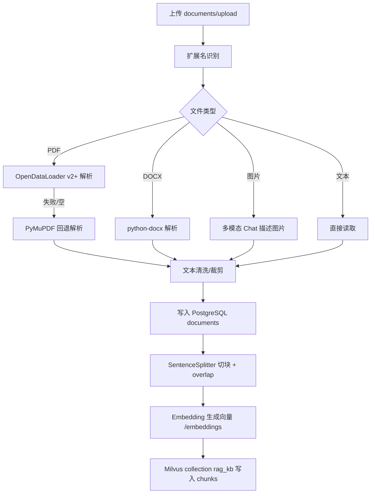

# 论文修改及流程图生成（按当前项目实现）

本文件用于将论文中的“文档处理流程、提问检索流程”改写为 **完全符合当前项目代码** 的版本，并生成对应流程图（Mermaid）。

> 重要差异：当前项目 **不使用 BM25**，也不做“向量 + BM25 融合排序”。排序逻辑为：Milvus 相似度召回 → 知识组权重加权 →（可选）硅基 `/rerank` 精排。

---

## 一、文档处理流程（可直接粘贴入论文）

文档上传后首先进行格式识别：系统根据文件扩展名选择对应解析器进行内容提取。随后进入解析阶段：

- **PDF**：优先使用 **OpenDataLoader PDF v2+** 将 PDF 转为文本；若解析失败或返回空内容，则自动回退 **PyMuPDF** 进行文本提取，以保证在缺少 Java 环境时仍可运行。
- **DOCX**：使用 **python-docx** 提取段落文本。
- **图片**：使用 **OpenAI 兼容的多模态 Chat** 接口进行图像内容描述与文字提取，具体调用的提供商由前端设置页选择（硅基 / OpenAI / Ollama）。

解析得到的文本会进行轻量清洗（例如剔除 NUL 字符等不兼容字符，并对极长片段做裁剪以适配数据库字段与向量库约束），然后写入 **PostgreSQL** 的 `documents` 表（SQLModel 管理），实现“全文可追溯”与引用反查。

接着系统对文档进行切块：采用 `SentenceSplitter` 按固定 chunk_size 切分文本，并设置 **chunk_overlap** 形成相邻块重叠，降低关键信息被截断的概率。每个文档块携带元数据：`doc_id`（文档主键）、`chunk_index`（文档内块序号）、`name`（文档名）。

最后进行向量化入库：系统调用 Embedding 模型（OpenAI 兼容 `/embeddings`，提供商可选硅基/OpenAI/Ollama）为每个 chunk 生成向量，并将向量与元数据写入 **Milvus** 的单一 collection（默认 `rag_kb`）。为保证一致性，当文档发生变更或 Embedding 模型发生切换时，系统会 drop 并重建该 collection，再全量写入最新 chunk 与向量。

---

## 二、提问检索流程（可直接粘贴入论文）

用户选择一个或多个知识组并发起提问时，系统执行如下检索增强生成流程：

1. **知识组过滤集合构建**：系统根据用户选择的知识组 ID，从 PostgreSQL 读取 `groups` 与 `group_members` 关系，得到目标文档集合（`doc_id` 列表）。系统支持多组选中，并为每个组设置优先级权重（主/次组），用于后续排序加权。
2. **向量召回**：系统对用户问题进行向量化（Embedding），并在 Milvus 中执行相似度检索召回 top-K 候选 chunk。检索阶段使用 Milvus 的表达式过滤 `doc_id in (...)`，直接在向量库侧过滤不属于目标集合的候选块。
3. **加权与精排**：
   - 首先根据知识组优先级对候选块分数进行加权，体现“主组优先、次组次之”的业务偏好；
   - 若配置了硅基 rerank（`rerank_provider=siliconflow` 且 Key/Base/模型齐全），系统调用在线 `/rerank` 对候选块做精排，获得更稳定的相关性排序，并取 top-N 作为最终上下文；
   - 若选择 OpenAI 或 Ollama 作为 rerank 提供商（无标准 `/rerank` 接口），系统不调用在线 rerank，而是按向量分数/权重排序直接截断 top-N。
4. **上下文拼装与引用**：系统将 top-N chunk 组织为上下文输入，每条片段都带 `[来源i]`、`doc_id`、`chunk_index` 等信息以便追溯。回答生成后，系统会根据本轮引用到的 `doc_id` 列表回查 PostgreSQL 获取文档名，并在文本末尾追加 `【引用文档】` 列表；同时在 SSE 事件中返回 `sources` 结构供前端展示。
5. **路由与专家调用（多智能体）**：系统由**协调者模型**基于用户问题输出结构化路由（domain + delegates + reason），自主决定调用医疗/法律专家模型或使用 Team coordinate 融合输出，并在回答开头输出 `【路由说明】...` 作为可解释记录。

---

## 三、流程图（Mermaid）

### 3.1 文档处理与向量入库流程



### 3.2 提问检索与生成（SSE）流程

```mermaid
flowchart TD
  A[POST /query (SSE)] --> B[读取 thread_id 历史]
  B --> C[可选：图片->描述->拼入问题]
  C --> D[查询知识组 -> doc_id 集合]
  D --> E[Embedding(question)]
  E --> F[Milvus search topK + expr 过滤 doc_id]
  F --> G[组权重加权排序]
  G --> H{是否硅基 rerank?}
  H -->|是| I[/rerank 精排 topN]
  H -->|否| J[按向量/权重截断 topN]
  I --> K[拼上下文 [来源i]+doc_id+chunk_index]
  J --> K
  K --> L[协调者模型路由 domain+delegates]
  L --> M{delegates}
  M -->|medical| N[Medical Agent]
  M -->|legal| O[Legal Agent]
  M -->|mixed/none| P[Team coordinate 融合]
  N --> Q[SSE 输出 chunk...]
  O --> Q
  P --> Q
  Q --> R[追加【引用文档】+ sources 事件]
  R --> S[写入 chat_messages]
```

### 3.3 评估 `/evaluate`（论文数据输出）

```mermaid
flowchart TD
  A[POST /evaluate items[]] --> B[对每个 item: RAG 检索]
  B --> C[LLM 基于 context 生成 answer]
  C --> D[Embedding(answer) 与 Embedding(expected)]
  D --> E[余弦相似度 semantic_similarity]
  E --> F[输出 retrieval chunks/score + timing + stats]
```

