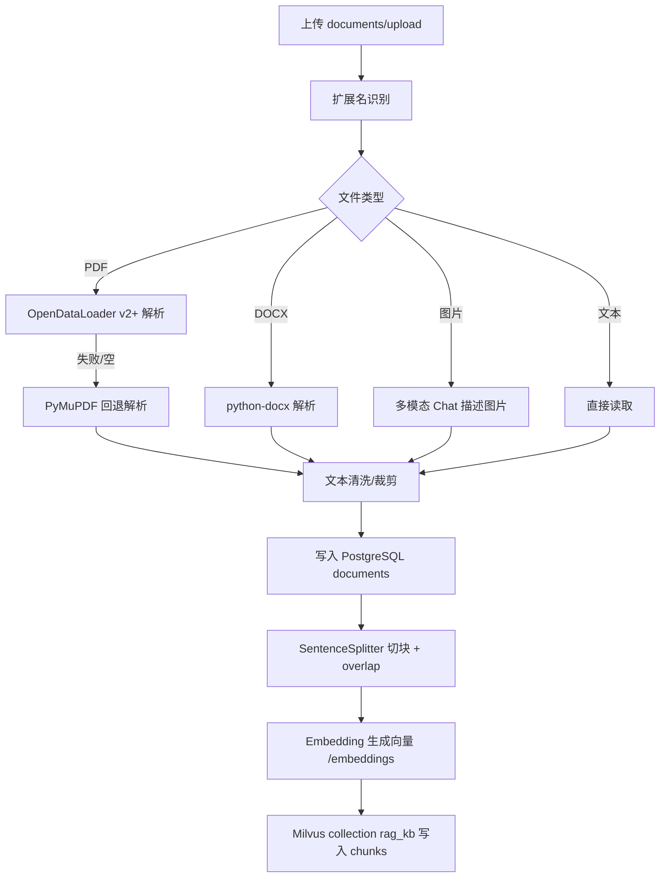

# 论文修改及流程图生成（按当前项目实现）

本文件用于将论文中的“文档处理流程、提问检索流程”改写为 **完全符合当前项目代码** 的版本，并生成对应流程图（Mermaid）。

> 当前实现：系统采用 **向量召回 + BM25 关键词打分的混合检索**。流程为：Milvus 相似度召回（topK 候选）→ 在候选集上计算 BM25 分数 → 与向量/组权重分数做归一化加权融合 →（可选）重排序服务精排。

---

## 一、文档处理流程（可直接粘贴入论文）

文档上传后首先进行格式识别：系统根据文件扩展名选择对应解析器进行内容提取。随后进入解析阶段：

- **PDF**：优先使用 **OpenDataLoader PDF v2+** 将 PDF 转为文本；若解析失败或返回空内容，则自动回退 **PyMuPDF** 进行文本提取，以保证在缺少 Java 环境时仍可运行。
- **DOCX**：使用 **python-docx** 提取段落文本。
- **图片**：使用 **OpenAI 兼容的多模态 Chat** 接口进行图像内容描述与文字提取，具体调用的提供商由前端设置页选择（硅基 / OpenAI / Ollama）。

解析得到的文本会进行轻量清洗（例如剔除 NUL 字符等不兼容字符，并对极长片段做裁剪以适配数据库字段与向量库约束），然后写入 **PostgreSQL** 的 `documents` 表（SQLModel 管理），实现“全文可追溯”与引用反查。

接着系统对文档进行切块：采用 `SentenceSplitter` 按固定 chunk_size 切分文本，并设置 **chunk_overlap** 形成相邻块重叠，降低关键信息被截断的概率。每个文档块携带元数据：`doc_id`（文档主键）、`chunk_index`（文档内块序号）、`name`（文档名）。

最后进行向量化入库：系统调用 Embedding 模型（OpenAI 兼容 `/embeddings`，提供商可选硅基/OpenAI/Ollama）为每个 chunk 生成向量，并将向量与元数据写入 **Milvus** 的单一 collection（默认 `rag_kb`）。为保证一致性，当文档发生变更或 Embedding 模型发生切换时，系统会 drop 并重建该 collection，再全量写入最新 chunk 与向量。

---

## 二、提问检索流程（可直接粘贴入论文）

用户选择一个或多个知识组并发起提问时，系统执行如下检索增强生成流程：

1. **知识组过滤集合构建**：系统根据用户选择的知识组 ID，从 PostgreSQL 读取 `groups` 与 `group_members` 关系，得到目标文档集合（`doc_id` 列表）。系统支持多组选中，并为每个组设置优先级权重（主/次组），用于后续排序加权。
   - 知识组在 `groups` 表中包含 `name/description/type`：其中 `type` 用于对知识组进行分类；`description` 用于说明组内文档主题，并可在前端通过检索接口按“名称/描述”快速定位知识组。
2. **向量召回**：系统对用户问题进行向量化（Embedding），并在 Milvus 中执行相似度检索召回 top-K 候选 chunk。检索阶段使用 Milvus 的表达式过滤 `doc_id in (...)`，直接在向量库侧过滤不属于目标集合的候选块。
3. **BM25 混合排序 + 精排**：
   - 在 top-K 候选集上对每个 chunk 文本计算 **BM25 关键词匹配分数**（中文分词使用 **jieba**）；
   - 将向量/组权重分数与 BM25 分数做归一化，并按权重进行融合排序（默认 `bm25_weight=0.35`，可通过 settings 覆盖）；
   - 若配置了 **重排序**：`rerank_provider=siliconflow` 且 Key、Base、Rerank 模型齐全时调用 `/rerank`；`rerank_provider` 为 `openai` 或 `ollama` 时通过 OpenAI 兼容 `/embeddings` 对问题与各候选块编码后按余弦相似度重排（此时 `reranker_model` 为 **embedding 模型 id**）。配置不完整或调用失败时按融合排序截断 top-N。
4. **上下文拼装与引用**：系统将 top-N chunk 组织为上下文输入，每条片段都带 `[来源i]`、`doc_id`、`chunk_index` 等信息以便追溯。回答生成后，系统会根据本轮引用到的 `doc_id` 列表回查 PostgreSQL 获取文档名，并在文本末尾追加 `【引用文档】` 列表；同时在 SSE 事件中返回 `sources` 结构供前端展示。
5. **路由与专家调用（多智能体）**：协调者路由与默认回答共用 **`llm_model`**（单独一次低温度调用输出 JSON：domain + delegates + reason），再按 delegates 调用医疗/法律单 Agent 或 Team coordinate 融合输出，并在回答开头输出 `【路由说明】...` 作为可解释记录。

---

## 三、流程图（Mermaid）

### 3.1 文档处理与向量入库流程



### 3.2 提问检索与生成（SSE）流程

```mermaid
flowchart TD
  A["POST /query（SSE）"] --> B["读取 thread_id 历史"]
  B --> C[可选：图片->描述->拼入问题]
  C --> D[查询知识组 -> doc_id 集合]
  D --> E[Embedding(question)]
  E --> F[Milvus search topK + expr 过滤 doc_id]
  F --> G[组权重加权 + BM25 关键词打分]
  G --> H[融合排序（向量/权重 + BM25）]
  H --> I{重排序方式}
  I -->|硅基 /rerank| J["Rerank API 精排 topN"]
  I -->|OpenAI 或 Ollama embeddings 余弦| J2["embeddings 余弦精排 topN"]
  I -->|未配置或失败| K[按融合排序截断 topN]
  J --> L[拼上下文 [来源i]+doc_id+chunk_index]
  J2 --> L
  K --> L
  L --> M[协调者模型路由 domain+delegates]
  M --> N{delegates}
  N -->|medical| O[Medical Agent]
  N -->|legal| P[Legal Agent]
  N -->|mixed/none| Q[Team coordinate 融合]
  O --> R[SSE 输出 chunk...]
  P --> R
  Q --> R
  R --> S[追加【引用文档】+ sources 事件]
  S --> T[写入 chat_messages]
```

### 3.3 评估 `/evaluate`（论文数据输出）

```mermaid
flowchart TD
  A["POST /evaluate（items 列表）"] --> B["对每个 item：RAG 检索"]
  B --> C[LLM 基于 context 生成 answer]
  C --> D[Embedding(answer) 与 Embedding(expected)]
  D --> E[余弦相似度 semantic_similarity]
  E --> F[输出 retrieval chunks/score + timing + stats]
```

---

## 四、（二）数据库设计（PostgreSQL + Milvus，可直接粘贴入论文）

本系统采用 **PostgreSQL** 作为关系数据库，使用 **SQLModel** 作为 ORM 工具统一管理所有数据表；同时采用 **Milvus** 作为向量数据库，存储文档切块后的向量与检索所需元数据。以下对各核心表/集合的设计进行详细说明。

### 4.1 文档信息表设计

该表用于存储上传文档的基本信息和全文内容，支撑文档元信息管理、解析状态追踪、以及检索阶段的引用反查。

表1 文档信息表 `documents`

| 字段名称 | 描述 | 数据类型 | 主键/外键 |
| --- | --- | --- | --- |
| id | 文档唯一标识（UUID 字符串） | VARCHAR(64) | PK |
| name | 文件名 | TEXT |  |
| path | 文件存储路径 | TEXT |  |
| text | 文档全文内容（清洗后写入） | TEXT |  |
| status | 解析状态（queued/parsing/embedding/done/error） | VARCHAR(32) |  |
| progress | 解析进度百分比（0-100） | INTEGER |  |
| error | 解析失败时的错误信息 | TEXT |  |
| created_at | 创建时间 | TIMESTAMPTZ |  |

其中 `status` 字段用于追踪文档从上传到向量化入库的生命周期；`progress` 字段供前端展示处理进度；`error` 字段在解析失败时记录异常信息便于调试。`id` 字段作为主键，同时也是 `group_members` 表中引用文档的外键来源。

### 4.2 知识组信息表设计

该表用于存储知识组的基本信息，支撑知识组的增删改查操作。

表2 知识组信息表 `groups`

| 字段名称 | 描述 | 数据类型 | 主键/外键 |
| --- | --- | --- | --- |
| id | 知识组唯一标识（UUID 字符串） | VARCHAR(64) | PK |
| name | 知识组名称 | TEXT |  |
| description | 知识组描述（组内文档主题说明） | TEXT |  |
| type | 知识组类型（用于分类/筛选/检索） | VARCHAR(32) |  |

其中 `description` 字段用于描述该知识组覆盖的知识范围（便于前端按“名称/描述”检索定位）；`type` 字段用于对知识组进行分类筛选（如 legal/medical/finance/general 等）。`id` 字段作为主键，被 `group_members` 表引用；`name` 字段在问答界面的知识组选择器中展示。

### 4.3 知识组-文档关联表设计

系统允许一个知识组包含多个文档，一个文档也可属于多个知识组，因此采用多对多关联表记录归属关系。该表也是检索前构建 doc_id 集合的关键入口。

表3 关联表 `group_members`

| 字段名称 | 描述 | 数据类型 | 主键/外键 |
| --- | --- | --- | --- |
| group_id | 知识组 ID | VARCHAR(64) | PK, FK→groups.id |
| doc_id | 文档 ID | VARCHAR(64) | PK, FK→documents.id |

该表以 `(group_id, doc_id)` 作为联合主键，既保证同一组内同一文档不会重复加入，也利于按组快速查询文档集合。系统额外为 `group_id`、`doc_id` 建立单列索引，提高按组/按文档的筛选效率。

### 4.4 对话消息表设计

该表用于持久化对话上下文（thread），支持在同一 thread 上连续提问与追溯历史。系统按 `thread_id` 顺序读取历史消息，并在每轮 SSE 问答结束后写入本轮问答。

表4 对话消息表 `chat_messages`

| 字段名称 | 描述 | 数据类型 | 主键/外键 |
| --- | --- | --- | --- |
| id | 消息自增 ID | BIGINT | PK |
| thread_id | 会话线程 ID | VARCHAR(256) |  |
| role | 角色（user/assistant/system） | VARCHAR(32) |  |
| content | 消息内容（文本） | TEXT |  |
| created_at | 创建时间（Unix 秒） | INTEGER |  |

系统对 `(thread_id, id)` 建立联合索引，以支持“按 thread_id 顺序读取历史消息”的高频查询。

### 4.5 系统元信息表设计

该表用于存储系统级元数据（例如当前 embedding 模型标识），用于索引一致性检查与评估/调试追溯。

表5 系统元信息表 `app_meta`

| 字段名称 | 描述 | 数据类型 | 主键/外键 |
| --- | --- | --- | --- |
| key | 元信息键 | VARCHAR(128) | PK |
| value | 元信息值 | TEXT |  |

### 4.6 Milvus 向量数据库设计

Milvus 用于存储“文档切块后的向量”及检索所需元数据，使系统能够对用户问题进行向量相似度检索（COSINE），并在候选集合上进一步做 **BM25（jieba 分词）混合排序** 与（可选）重排序服务精排。

系统将所有文档块统一写入单一 collection（默认 `rag_kb`），每条向量记录对应一个 chunk，核心字段语义如下：

- **vector**：embedding 向量（维度与所选 embedding 模型一致）
- **doc_id**：对应 `documents.id`，用于“按知识组过滤”（Milvus 侧 expr 过滤）
- **name**：文档名（用于展示与引用）
- **text**：chunk 原文（用于 BM25 关键词打分、拼接上下文）
- **chunk_index**：文档内块序号（用于来源定位与引用展示）

> 检索时系统优先在 Milvus 侧使用表达式过滤 `doc_id in (...)`，将不属于目标知识组的候选块提前剔除，降低后续混排与精排开销。

---

## 五、（八）SQLModel 与数据表管理简介（可直接粘贴入论文）

本系统使用 **SQLModel** 统一管理 PostgreSQL 中的所有数据表。SQLModel 结合了 SQLAlchemy 的 ORM 能力与 Pydantic 的数据校验能力，开发者只需定义 Python 类，即可同时获得数据库模型与 API 数据校验能力。当前项目的核心模型包括：`Document`、`Group`、`GroupMember`、`ChatMessage`、`AppMeta`。

SQLModel 会在应用启动/初始化时完成表创建与字段映射（`SQLModel.metadata.create_all(engine)`），并通过索引提升典型查询性能（例如按 `status`、`created_at`、`thread_id` 等过滤与排序）。

典型查询示例：根据知识组查询该组包含的所有文档元信息。系统先从 `group_members` 获得该组 doc_id 列表，再批量查询文档记录：

```python
from sqlmodel import Session, select
from rag_demo.storage.models import Document

with Session(engine) as session:
    group_doc_ids = ["..."]  # 来自 group_members
    docs = session.scalars(
        select(Document).where(Document.id.in_(group_doc_ids))
    ).all()
```

通过以上查询即可得到知识组内文档的元数据（name/path/status/created_at 等），用于检索阶段构建过滤集合、以及回答阶段引用反查并输出 `【引用文档】` 列表。

---

## 六、（三）Milvus 向量数据库设计（可直接粘贴入论文）

本系统采用 **Milvus** 作为向量数据库，用于存储“文档切块（chunk）后的向量表示”及检索所需的元数据，从而支持对用户问题进行高效的向量相似度检索，并与 BM25（jieba 分词）和（可选）在线 rerank 共同构成混合检索与精排链路。

### 6.1 设计目标与作用

- **高效召回**：将每个 chunk 的 embedding 向量写入 Milvus，通过 **COSINE** 相似度进行 top-K 召回。
- **知识组过滤**：通过 chunk 元数据中的 `doc_id`，在 Milvus 查询时使用表达式 `doc_id in (...)` 做“向量库侧过滤”，避免无关文档进入候选集。
- **与文本检索协同**：Milvus 负责“语义相似度召回”，BM25 负责“关键词匹配补强”，两者融合排序后再进入（可选）重排序精排。

### 6.2 数据组织方式（单 Collection）

系统将所有知识组/所有文档的 chunk 统一存入单一 collection（默认 `rag_kb`）。每条记录对应一个 chunk，核心字段与语义如下（以当前实现为准）：

| 字段 | 含义 | 用途 |
| --- | --- | --- |
| vector | chunk 的 embedding 向量 | 向量相似度检索（COSINE） |
| doc_id | 来源文档 ID（对应 PostgreSQL `documents.id`） | knowledge group 过滤（expr）/引用反查 |
| name | 文档名 | 前端展示/引用列表 |
| text | chunk 原文 | BM25 打分 / 拼装上下文 |
| chunk_index | 文档内块序号 | 来源定位（`doc_id + chunk_index`） |

> 说明：系统回答阶段的 `【引用文档】` 以 PostgreSQL 为准（通过 `doc_id` 回查文档名）；Milvus 主要承担“候选 chunk 召回 + chunk 元数据携带”职责。

### 6.3 索引与检索参数

- **相似度度量（metric）**：COSINE
- **索引类型（示例）**：可选 IVF_FLAT / HNSW（由 `rag_demo/rag/milvus_store.py` 封装创建）
- **常用检索参数**：
  - `topK`：召回候选 chunk 数
  - `nprobe`：IVF 类索引的检索探针数（若使用 IVF）
  - `ef`：HNSW 的检索扩展参数（若使用 HNSW）

> 实际取值需结合数据规模与延迟目标调参；本项目将 Milvus 的 collection 管理与检索调用统一封装，便于后续迭代优化。

### 6.4 与 PostgreSQL 的一致性

- **PostgreSQL**：存储文档全文与元信息（`documents/groups/group_members/chat_messages/app_meta`），用于可追溯、权限/分组过滤、引用反查与对话留痕。
- **Milvus**：存储 chunk 向量与检索元数据（`doc_id/name/text/chunk_index`），用于高效语义召回与候选集获取。
- **一致性策略**：
  - `doc_id` 作为两库关联键：Milvus 召回的 chunk 通过 `doc_id` 回查 PostgreSQL 获取文档名并输出 `【引用文档】`。
  - embedding 模型切换时需重建向量空间：系统用 `app_meta` 记录 embedding 模型标识；必要时 drop 并重建 `rag_kb`，再全量写入最新 chunk 向量，保证向量空间一致性。

### 6.5 一致性与重建策略

由于不同 Embedding 模型对应不同向量空间，为保证检索一致性，系统会在以下场景重建 collection 并重新写入：

- 文档内容发生变化（需要更新其对应的 chunk 向量）
- Embedding 模型发生切换（需要整体重建向量索引空间）

系统使用 PostgreSQL 的 `app_meta` 存储当前 embedding 模型标识，启动/索引构建时进行一致性检查；必要时 drop 并重建 `rag_kb`，再全量写入最新 chunk 与向量。

